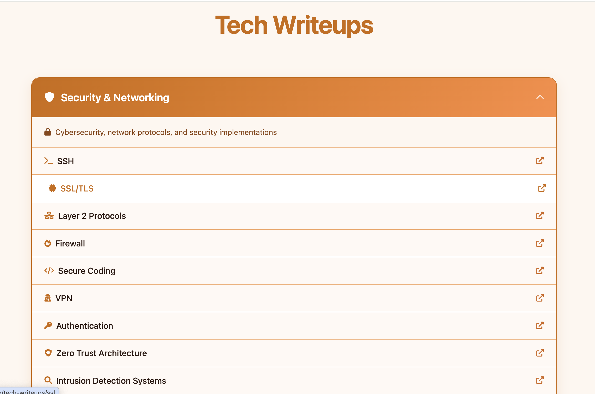
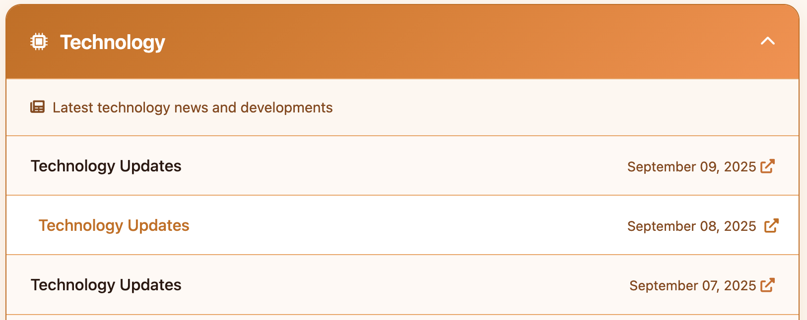

### Portfolio

Website now live at -> https://archie-linux.github.io

### Writeups

The writeups are AI slops and I have already clarified it's purpose earlier. It's suppose to give a headstart in a lot of different domains and not to showcase my writing or editing skills. These were mostly curated for myself out of curiosity but if it helps anyone else then great. I'll also be way more upfront that I am least interested in the frontend, machine learning, and cloud & devops section. I just happened to have generated for those as well.

### News

CI Runs have been automated and they kick off at 8 am UTC daily

Successful First Run

